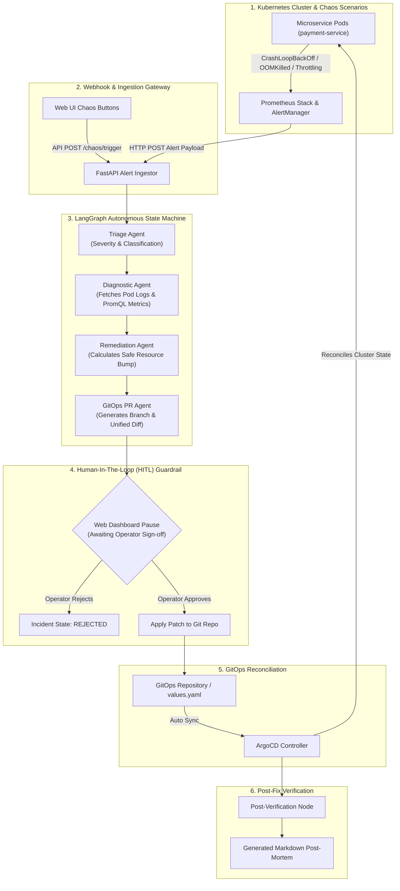
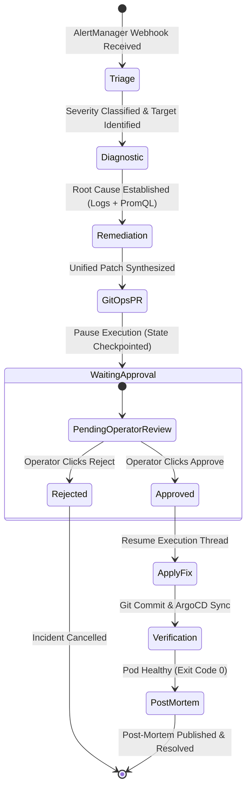

# ⚡ KubeOps-Aegis: Autonomous Self-Healing Kubernetes & GitOps AI Agent

[](https://python.org)
[](https://langchain-ai.github.io/langgraph/)
[](https://kubernetes.io)
[](https://argoproj.github.io/argo-cd/)
[](https://terraform.io)
[](https://prometheus.io)

---

## 🎯 Executive Summary & Why This Project Matters

**KubeOps-Aegis** is an enterprise-grade, cloud-native **Autonomous SRE & GitOps AI Engine** designed to automate incident triage, root-cause diagnosis (RCA), and declarative cluster remediation in high-velocity production Kubernetes environments.

> ### 🚨 The Critical Problem in AI-Driven Cloud Operations
> Most naive AI agent implementations attempt to fix Kubernetes incidents by directly executing imperative cluster mutations (`kubectl edit`, `kubectl patch`, or `kubectl scale`). 
> 
> **In production Kubernetes, direct cluster mutation is an anti-pattern that breaks systems:**
> 1. **GitOps Drift & Overwrites**: ArgoCD or Flux continuously monitor Git manifests. Imperative `kubectl` patches create immediate configuration drift—causing ArgoCD to automatically overwrite your AI fix during its next sync loop.
> 2. **Lack of Auditability**: Direct cluster edits bypass security reviews, Git commit histories, and compliance policies.
> 3. **Unchecked LLM Hallucinations**: Running an autonomous agent with cluster `cluster-admin` privileges without a **Human-in-the-Loop (HITL)** guardrail risks destructive actions during hallucinated root causes.

### 🛡️ The KubeOps-Aegis Solution
KubeOps-Aegis solves this by decoupling **incident analysis** from **cluster execution**:
- **Zero Direct Mutation Policy**: The AI agent *never* executes imperative mutations against the live cluster.
- **Declarative GitOps Remediation**: Remediation plans are synthesized strictly as Git Pull Requests modifying declarative Helm `values.yaml` files.
- **Resumable HITL Guardrail**: Built on **LangGraph State Graph Checkpointing**, execution pauses deterministically at a Human-in-the-Loop breakpoint, rendering a side-by-side unified diff for human SRE review.
- **ArgoCD Reconciliation Loop**: Upon human approval, the PR is merged into Git, allowing ArgoCD to reconcile cluster state declaratively.

---

## 🏛️ System Architecture & Execution Flow

### 1. End-to-End System Architecture



---

### 2. LangGraph Multi-Agent State Machine Flow



---

## 🚀 Key Architectural Features

1. **Stateful Agentic State Machine (LangGraph)**:
   - Uses `StateGraph` with `MemorySaver` checkpointing, allowing execution threads to freeze safely at human approval steps and resume without losing context.
2. **Strict Multi-Agent Separation of Concerns**:
   - **Triage Agent**: Categorizes incident severity (`CRITICAL`, `HIGH`, `MEDIUM`) and identifies target workloads.
   - **Diagnostic Agent**: Fetches pod logs (`previous=True`), warning events, and PromQL metric graphs.
   - **Remediation Agent**: Calculates quota-compliant resource adjustments (e.g., memory requests/limits).
   - **GitOps Agent**: Constructs Git branches, PR descriptions, and unified diffs.
   - **Post-Mortem Writer**: Generates executive incident reports in Markdown upon resolution.
3. **Interactive SRE Web Dashboard**:
   - Dark-mode Glassmorphism interface featuring WebSocket step streaming, side-by-side diff previews, incident history, and interactive chaos injection buttons.
4. **Production AWS EKS Infrastructure (Terraform)**:
   - Modular Infrastructure-as-Code establishing AWS VPC, EKS 1.30+ cluster, OIDC IAM Roles for Service Accounts (IRSA), ArgoCD, Prometheus, and Karpenter auto-provisioning.
5. **Dual Tool Execution (Live Cluster & Zero-Cost Offline Demo)**:
   - Supports active EKS / Kind cluster connection, and automatically falls back to offline simulation mode for zero-cost local demonstrations.

---

## 📂 Repository Structure

```
cloudnative-ai-ops/
├── agent/                         # Core AI-Ops Engine (Python + LangGraph + FastAPI)
│   ├── app/
│   │   ├── agents/                # Triage, Diagnostic, Remediation, GitOps, PostMortem agents
│   │   ├── api/                   # FastAPI REST routes & WebSocket connection manager
│   │   ├── core/                  # Configuration, LLM factory, and IncidentState schemas
│   │   ├── graph/                 # LangGraph State Machine compilation & execution flow
│   │   ├── tools/                 # Kubernetes API, Prometheus PromQL, and Git tools
│   │   └── main.py                # Agent application entrypoint
│   ├── tests/                     # Pytest suite covering state machine transitions
│   └── requirements.txt
├── web/                           # Real-Time Glassmorphism SRE Dashboard
│   ├── index.html                 # Layout & UI components
│   ├── styles.css                 # Dark theme styling & animations
│   └── app.js                     # WebSocket streaming & HITL action handlers
├── k8s/                           # Kubernetes Manifests & Chaos Tools
│   ├── monitoring/                # PrometheusRules & AlertManager webhooks
│   └── chaos/                     # Bash chaos scripts (OOM, CrashLoop, Throttling)
├── gitops/                        # GitOps Target Repository (reconciled by ArgoCD)
│   ├── apps/payment-service/      # Helm Chart & values.yaml
│   └── argocd/                    # ArgoCD Application CRDs
├── terraform/                     # Production AWS EKS IaC
│   ├── main.tf                    # VPC & EKS 1.30+ cluster modules
│   ├── iam.tf                     # OIDC Provider & IRSA IAM policies
│   ├── argocd.tf                  # ArgoCD Helm deployment
│   ├── prometheus.tf              # Prometheus Stack Helm deployment
│   ├── karpenter.tf               # Karpenter Autoscaler & NodePool CRDs
│   ├── variables.tf / outputs.tf  # Input/output definitions
│   └── env/prd.tfvars             # Production environment variables
├── scripts/                       # Orchestration Scripts
│   ├── run_agent.ps1              # Agent daemon launcher
│   ├── setup_local_kind.ps1       # Local Kind cluster bootstrap
│   └── simulate_incident.py       # CLI interactive demo runner
└── README.md
```

---

## ⚡ Quickstart & Operation Modes

### Mode 1: 60-Second Offline Demo (Zero Dependencies & Zero Cloud Cost)

Run the agent backend and dashboard locally without needing an AWS account or local Kubernetes cluster:

```powershell
# 1. Install dependencies
cd agent
pip install -r requirements.txt

# 2. Launch agent daemon and dashboard server
cd ..
powershell scripts/run_agent.ps1
```

Open your browser at **`http://localhost:8000`** to interact with the **KubeOps-Aegis SRE Dashboard**. Click **💥 Inject OOMKilled** to observe real-time incident resolution!

---

### Mode 2: Local Kubernetes (Kind) & Chaos Testing

Test against a live local Kubernetes cluster:

```powershell
# 1. Bootstrap Kind cluster with ArgoCD and payment-service
powershell scripts/setup_local_kind.ps1

# 2. Trigger OOM Chaos in local cluster
bash k8s/chaos/trigger_oom.sh

# 3. Launch agent configured for local Kubeconfig
$env:MOCK_K8S="false"
python -m agent.app.main
```

---

### Mode 3: Enterprise AWS EKS Production Deployment (Terraform)

Spin up complete AWS infrastructure:

```bash
cd terraform

# 1. Initialize Terraform modules
terraform init

# 2. Apply infrastructure plan
terraform apply -var-file="env/prd.tfvars" -auto-approve

# 3. Update local Kubeconfig for EKS
aws eks update-kubeconfig --name prd-k8s-aiops-cluster --region us-east-1
```

---

## 🎯 Architectural Defense & Technical FAQ

| Question | Senior Technical Rationale |
| :--- | :--- |
| **Why use LangGraph instead of linear chains?** | Incident remediation requires non-linear state graphs with cyclic transitions, checkpointing, and resumable execution nodes to safely handle Human-in-the-Loop interrupts. |
| **Why prevent direct `kubectl` cluster edits?** | Imperative cluster edits cause immediate GitOps drift. ArgoCD's reconciliation loop would automatically revert direct cluster changes. Modifying Git manifests maintains an immutable audit trail. |
| **How are LLM hallucinations mitigated?** | Through strictly enforced Pydantic schemas, typed tool interfaces, deterministic diff generation, and mandatory SRE approval before Git commits. |
| **How does alert routing work?** | Prometheus AlertManager sends webhook payloads to FastAPI `/webhook/alertmanager`. The handler parses labels, initializes a unique `IncidentState`, and kicks off an asynchronous LangGraph thread. |

---

## 🧪 Automated Testing

Run the automated test suite verifying state machine transitions and agent node execution:

```bash
python -m pytest agent/tests/test_workflow.py -v
```

---

## 📄 License
MIT License. Built for enterprise Cloud-Native & AI-Ops engineering teams.