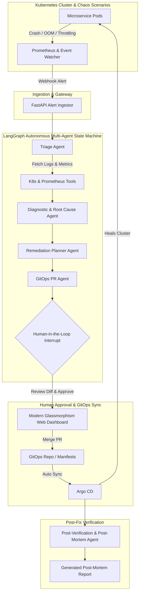

# ⚡ KubeOps-Aegis: Autonomous Self-Healing Kubernetes & GitOps Agent

[](https://python.org)
[](https://langchain-ai.github.io/langgraph/)
[](https://kubernetes.io)
[](https://argoproj.github.io/argo-cd/)
[](https://terraform.io)
[](https://prometheus.io)

**KubeOps-Aegis** is an enterprise-grade, cloud-native **Autonomous SRE & GitOps AI Agent** engineered for production Kubernetes environments. 

When incidents occur in a cluster (`CrashLoopBackOff`, `OOMKilled`, CPU Throttling, Failing Probes), KubeOps-Aegis intercepts alerts, diagnoses the root cause across logs and metrics, synthesizes safe declarative Helm/YAML patches, halts for human approval via an interactive web dashboard or CLI, and heals the cluster through **ArgoCD GitOps synchronization**—**strictly preventing direct cluster mutations and drift**.

---

## 🏛️ System Architecture



---

## 🚀 Key Features

1. **Multi-Agent State Machine (LangGraph)**:
   - Built on LangGraph `StateGraph` with state checkpointing and resumable execution.
   - Distinct, specialized agents for **Triage**, **Diagnostics (RCA)**, **Remediation**, **GitOps**, and **Post-Mortem generation**.
2. **True GitOps Compliance (ArgoCD)**:
   - **Zero Direct Cluster Mutation**: Avoids `kubectl edit/patch` in production.
   - Proposes changes strictly via Git PRs and Helm value updates, allowing ArgoCD to reconcile cluster state declaratively.
3. **Human-in-the-Loop (HITL) Safety Guardrails**:
   - Webhook interrupts pause the execution graph with full unified diff previews for SRE sign-off before committing.
4. **Real-Time Interactive Web Dashboard**:
   - Modern dark-mode Glassmorphism dashboard featuring live incident feeds, WebSocket step streaming, side-by-side diff viewer, and instant chaos injection buttons.
5. **Interview-Ready Chaos Suite**:
   - One-click chaos scenarios (`OOMKilled`, `CrashLoopBackOff`, `CPU Throttling`) to demonstrate self-healing in real-time.
6. **Production AWS EKS Infrastructure (Terraform)**:
   - Complete Terraform IaC configuring AWS VPC, EKS 1.30+ cluster, Node Groups, OIDC IAM Roles for Service Accounts (IRSA), ArgoCD, and Prometheus stack.

---

## 📂 Repository Structure

```
cloudnative-ai-ops/
├── agent/                         # Core AI-Ops Engine (Python + LangGraph)
│   ├── app/
│   │   ├── core/                  # App settings, state schemas & LLM factory
│   │   ├── agents/                # Triage, Diagnostic, Remediation, GitOps, PostMortem agents
│   │   ├── tools/                 # Kubernetes API, Prometheus PromQL, Git tools
│   │   ├── graph/                 # LangGraph StateMachine compilation & workflow
│   │   ├── api/                   # FastAPI routes & WebSocket manager
│   │   └── main.py                # Application entrypoint
│   ├── tests/                     # Pytest suite for agents & transitions
│   └── requirements.txt
├── web/                           # Real-Time Glassmorphism SRE Dashboard
│   ├── index.html                 # UI layout
│   ├── styles.css                 # Dark theme & animations
│   └── app.js                     # WebSocket client & HITL approval triggers
├── k8s/                           # Kubernetes Manifests & Chaos Tools
│   ├── monitoring/                # PrometheusRules & AlertManager config
│   └── chaos/                     # Bash chaos scripts (OOM, CrashLoop, Throttling)
├── gitops/                        # GitOps Application Repo (watched by ArgoCD)
│   ├── apps/payment-service/      # Helm Chart & values.yaml
│   └── argocd/                    # ArgoCD Application & Project definitions
├── terraform/                     # Production AWS EKS Infrastructure as Code
│   ├── main.tf                    # VPC + EKS Cluster
│   ├── iam.tf                     # OIDC & IRSA policies
│   ├── argocd.tf                  # ArgoCD Helm deployment
│   ├── prometheus.tf              # Prometheus Stack Helm deployment
│   └── variables.tf / outputs.tf
├── scripts/                       # Setup & Demo Scripts
│   ├── setup_local_kind.ps1       # Local Kind cluster bootstrap
│   ├── run_agent.ps1              # Agent daemon launcher
│   └── simulate_incident.py       # Interactive CLI demo simulator
└── README.md
```

---

## ⚡ Quickstart & Live Demo

### 1. Run Locally in 60 Seconds (Zero-Dependency Mock/Demo Mode)

You can run the entire agent with its interactive dashboard without needing an active AWS account or local Kind cluster:

```bash
# 1. Install dependencies
cd agent
pip install -r requirements.txt

# 2. Start the KubeOps-Aegis Agent Server
cd ..
powershell scripts/run_agent.ps1
```

Open your browser at **`http://localhost:8000`** to access the **KubeOps-Aegis SRE Dashboard**.

### 2. Demonstrate an Incident (Web or CLI)

1. Click **💥 Inject OOMKilled** on the dashboard.
2. Watch the LangGraph state machine:
   - **Triage Agent** classifies severity as `CRITICAL`.
   - **Diagnostic Agent** pulls logs and identifies the `SIGKILL (exit code 137)` memory exhaustion.
   - **Remediation Agent** calculates a safe memory bump from `512Mi` to `1Gi`.
   - **GitOps Agent** generates a Pull Request and pauses at the Human-in-the-Loop checkpoint.
3. Click **⚡ Approve & Merge via ArgoCD**.
4. The agent commits the fix, marks the incident as `RESOLVED`, and generates the incident post-mortem report!

Or run the interactive CLI simulator:
```bash
python scripts/simulate_incident.py
```

---

## ☁️ Deploying to Production (AWS EKS via Terraform)

To spin up the complete cloud-native infrastructure on AWS:

```bash
cd terraform

# 1. Initialize Terraform
terraform init

# 2. Preview infrastructure plan
terraform plan

# 3. Apply infrastructure (EKS, VPC, IRSA, ArgoCD, Prometheus)
terraform apply -auto-approve

# 4. Connect kubectl to your new EKS cluster
$(terraform output -raw kubeconfig_command)
```

---

## 🎯 How to Explain This Project in Interviews

| Interviewer Question | High-Impact Answer |
| :--- | :--- |
| **Why use LangGraph over standard LangChain chains?** | *"Standard chains are linear DAGs. Real SRE incident response requires cyclic state transitions, checkpointing, and human-in-the-loop interrupts where an agent pauses execution, awaits human sign-off on a diff, and resumes state deterministically."* |
| **Why not mutate the cluster directly via `kubectl patch`?** | *"Direct cluster mutations create GitOps configuration drift. If ArgoCD runs an auto-sync, it will overwrite manual cluster changes. By forcing the AI agent to open a Git PR against `values.yaml`, we maintain an audit trail, immutability, and standard CI/CD compliance."* |
| **How do you prevent hallucinations in remediation?** | *"We use strict Pydantic schemas, isolated domain tools with typed parameters, deterministic unified diff generation, and policy guardrails that validate resource quotas before generating the GitOps PR."* |
| **How does Alert Ingestion work?** | *"Prometheus AlertManager routes firing alerts via webhook to our FastAPI receiver, which extracts the affected namespace and labels, instantiates an `IncidentState`, and kicks off the LangGraph thread asynchronously."* |

---

## 🧪 Automated Testing

Run the unit test suite covering state transitions and agent nodes:

```bash
cd agent
pytest tests/test_workflow.py -v
```

---

## 📄 License
MIT License. Built for modern Cloud-Native & AI-Ops engineers.